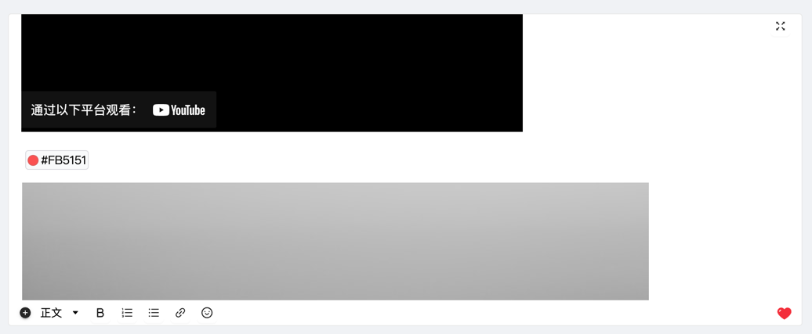

# @hocgin/editor

> 语雀同款的文本编辑器 [Demo](https://editor.hocg.in/components/editor)

## Usage

pnpm install @hocgin/editor

## Screen

#### 全屏模式


#### 小屏模式



## Development

```bash
# install dependencies
$ pnpm install

# develop library by docs demo
$ pnpm start

# build library source code
$ pnpm run build
```

## LICENSE

MIT
